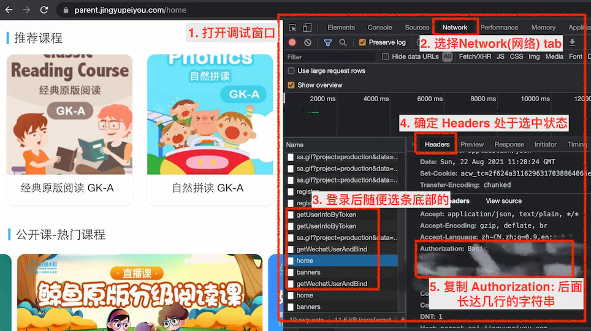

# 鲸鱼小班回放视频抓取工具

> 一鲸落, 万物生

双减一出, 鲸鱼凉凉了, 预存课时的钱也退不了, 维权无路.

这个脚本是我用来下自己家回放视频的, 如果能帮到其他朋友, 也能稍微开心些.

---
❤️  觉得好用的朋友给个 star 哈  ❤️ 

---
## 使用前须知

- 本工具不是必须的, 不会使用的朋友也不必焦虑. 
  - 原因一: 鲸鱼老系统在关闭前, 有提供历史视频导出的义务, 所以等待就好
  - 原因二: 有一个不用本工具的简单方法, 装浏览器插件来下载  
    - 鲸鱼课程的网址为 https://parent.jingyupeiyou.com/   
    - 里面可以看到所有回放视频, 但因为是流媒体格式,不方便下载.   
    - 可以自己找一个下载 m3u8 流媒体的浏览器插件, 在视频播放页使用来下载

- 本工具提供 2 个方法: 
  1. 用本工具协助一次性导出课程信息与视频地址, 然后用工具一个个下载(方法一) 
  2. 用本工具脚本批量下载, 适合愿意折腾或家中有程序员的(方法二) 

## 准备工作
下面两个方法, 都需要一个`Authorization`值(注意, 这个隐私信息不要给他人).
找到这个值的步骤:


1. 使用 Chrome (或可打开调试窗口的浏览器), 打开页面 https://parent.jingyupeiyou.com/
2. 打开调试窗口: Windows 按 F12 或 Ctrl+Shift+i, Mac 按 Cmd + Opt + i
3. 在页面中登录账号, 然后根据下图操作找到`Authorization`的值



⚠️ 注意: 不要泄露个人信息, 尤其是这个`Authorization`值给他人, 有了这个信息, 可以做很多事. 所以建议自己或家人操作(甚至都不建议使用方法一).


## 方法一: 页面手动下载

- 优点: 操作简单, 就算不下载也可以保持一下课程列表
- 缺点: 需要一个个手动下载整理, 已上课程较多的比较麻烦
- 步骤
  1. 打开页面 https://fancyoung.com/whales-english-exporter/fetch
  2. 输入上面的`Authorization`并提交
  3. 如果成功, 约10秒后, 你的所有课程信息会列出来, 每节课后类似`["https://jypy-playback.jingyupeiyou.com/xxxxxx.m3u8"]`的则是视频地址
  4. m3u8 的视频地址为流媒体, 一般无法直接下载, 我随便找了个可用的 http://blog.luckly-mjw.cn/tool-show/m3u8-downloader/index.html , 把第三步的地址轮流贴进来下载(大家也可以自己搜搜别的工具)

## 方法二: 自动批量抓取

- 优点: 批量, 省事
- 缺点: 有一定的技术门槛, 需要 Node 环境
- 步骤
  1. 下载代码
  2. 安装 node 环境(v14+)
  3. 执行命令
  ```
  npm install
  node main.js
  ```
  4. 根据提示, 在终端填入`Authorization` (上面准备信息里找到的)
  5. 开始自动抓取列表下载.

注意: 一定要保持硬盘空间足够, 预估方法 500M * 已上课时数.

PS: 鲸鱼哪天封回放, 别怪我……
